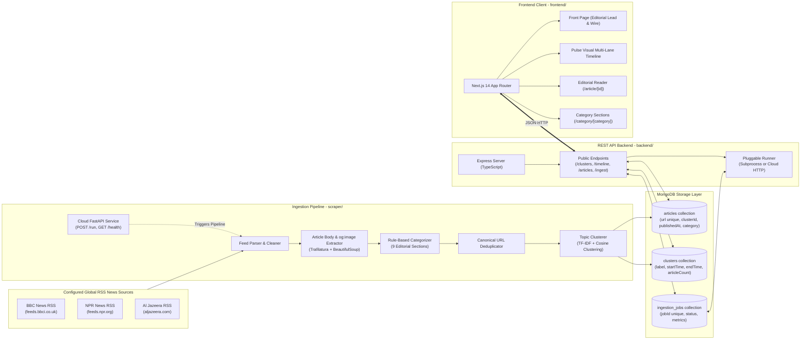

# News Pulse — Editorial Digital News Publication & Topic-Clustered Narrative Timeline

**News Pulse** is an automated digital news publication and narrative intelligence platform. It continuously ingests real-time RSS feeds from three configured public newsrooms (BBC News, NPR, Al Jazeera), extracts article body text and OpenGraph/Twitter photography, classifies reporting into editorial categories, and groups multi-source coverage into cohesive topic clusters along an interactive chronological timeline.

Designed to function as a modern digital newspaper with an embedded intelligence layer:
> *"News Pulse looks and feels like a digital news publication that features an intelligent topic-clustered timeline."*

**Status**: **Deployment-Ready** (Full deployment configuration manifests prepared for Render and Vercel; live cloud deployment has not yet been executed).

---

## Architectural Principles & Core Design Decisions

### 1. Document Store Choice: MongoDB
- **Rationale**: RSS news feeds from disparate global outlets exhibit polymorphic payloads (Atom 1.0 vs RSS 2.0 formats, varying media enclosures, publisher-specific metadata tags). MongoDB's schemaless document model stores these normalized articles without brittle relational schema migrations.
- **Indexes**: Compound and unique indexes ensure query performance and data integrity:
  - `articles`: Unique index on `url`, secondary indexes on `clusterId`, `publishedAt`, `source`, `category`.
  - `clusters`: Secondary index on `startTime` (descending for front page feeds, ascending for timeline).
  - `ingestion_jobs`: Unique index on `jobId`.
- **Cluster Persistence Model**: Cluster re-computation uses controlled bulk replacement/update operations (`delete_many` on clusters followed by `insert_many` and a `bulk_write` on articles). Multi-document transactional guarantees across collections are not currently used.

### 2. Topic Clustering: TF-IDF + Agglomerative Cosine Clustering
- **Implementation**: Text preprocessing normalizes headline and summary text, which is vectorized via `scikit-learn`'s `TfidfVectorizer` using unigrams and bigrams (`ngram_range=(1, 2)`). Clusters are computed using `AgglomerativeClustering(metric="cosine", linkage="average", distance_threshold=0.88, n_clusters=None)`, where the distance threshold is derived from the configured similarity threshold: `distance_threshold = 1.0 - 0.12 = 0.88`.
- **Algorithmic Complexity**:
  - Corpus vectorization: $\mathcal{O}(N \cdot L)$ where $N$ is document count and $L$ is average token count.
  - Pairwise cosine distance: $\mathcal{O}(N^2 \cdot M)$ where $M$ is feature count.
  - Agglomerative hierarchical clustering: $\mathcal{O}(N^2 \log N)$ time and $\mathcal{O}(N^2)$ space.
- **Performance Benchmark**:
  - *Measured Local Experiment*: On our local development machine evaluating the current 82-article dataset, the clustering step executed in **19.8 ms**. *(Note: This is a single measured local experiment on 82 documents, not a universal production benchmark).*
- **Empirical Threshold Evidence (0.12)**:
  Benchmarked directly on the active 82-article corpus from BBC News, NPR News, and Al Jazeera:
  - `Threshold 0.08`: 56 clusters, 19 multi-article, 37 singletons (begins merging loosely related news).
  - `Threshold 0.10`: 60 clusters, 17 multi-article, 43 singletons.
  - `Threshold 0.12` (Configured): **62 clusters, 15 multi-article, 47 singletons, max cluster size 4**. Forms tight cross-source clusters (e.g., German state elections across BBC & NPR, US-China AI talks across BBC & Al Jazeera) without merging distinct world events.
  - `Threshold 0.15`: 65 clusters, 14 multi-article, 51 singletons (begins fragmenting 4-article cross-source clusters).
  - `Threshold 0.20`: 69 clusters, 11 multi-article, 58 singletons (fragments cross-source coverage when outlets use distinct editorial vocabularies).

### 3. Optionality of Generative AI (Ollama)
- **Zero-Dependency Core**: Ingestion, extraction, and topic clustering operate autonomously without any local LLM, GPU, or remote API key.
- **Graceful Label Enhancement**: If an Ollama instance is running and reachable, it optionally generates a 2–4 word title label with a strict 3-second timeout. If unreachable or disabled (`AI_PROVIDER=none`), the clusterer deterministically selects top TF-IDF n-grams boosted by title frequency with zero pipeline delay.

### 4. Pluggable Ingestion Architecture: Subprocess vs HTTP Runner
- **Local Development**: In `subprocess` mode, the Node.js API spawns Python directly via child process. No Docker daemon or microservice orchestration is needed locally.
- **Cloud Readiness**: In `http` mode, the Node.js API dispatches an authenticated `POST /run` HTTP request with bearer secret to a standalone Python FastAPI service.

### 5. Temporal Timeline & Editorial Discovery
- **Discovery First, Analysis Second**: The homepage operates as an editorial newspaper (lead story hero, breaking news wire, category sections).
- **Temporal Intelligence**: The interactive Pulse Timeline plots multi-source stories across chronological lanes without cluttering raw news discovery.

---

## System Architecture

---

## Public REST API Specification

All routes are served directly at root (no `/api` prefix):

| Endpoint | Method | Params / Body | Description |
| :--- | :--- | :--- | :--- |
| `/clusters` | `GET` | — | Returns all topic clusters sorted by `startTime` descending. |
| `/clusters/:id` | `GET` | `id` (ObjectId) | Returns cluster details and all member articles sorted chronologically (`publishedAt` ascending: earliest &rarr; latest). |
| `/timeline` | `GET` | — | Returns chronological clusters (`startTime` ascending) with calculated bounds and active sources. |
| `/articles` | `GET` | `limit`, `offset`, `category`, `source` | Returns paginated article summaries with publisher and category metadata. |
| `/articles/:id` | `GET` | `id` (ObjectId) | Returns full article body text, image, category, and related cluster coverage. |
| `/articles/search` | `GET` | `q`, `category`, `source`, `limit`, `offset` | Multi-field search across titles, summaries, publishers, categories, and cluster labels. |
| `/categories` | `GET` | — | Returns distinct categories and real-time article counts. |
| `/ingest/trigger` | `POST` | — | Initiates asynchronous ingestion pipeline. Returns `202 Accepted` with `jobId`. Protected by concurrency guard (`409 Conflict` if run in progress). |
| `/ingest/status/:jobId` | `GET` | `jobId` | Returns execution status (`queued`, `running`, `completed`, `failed`) and feed metrics. |
| `/health` | `GET` | — | Health check validating service uptime and MongoDB connectivity. |

---

## Live Dataset Audit (Measured Ground Truth)

Audited directly against the active local MongoDB database (`news_pulse`):

- **Total Articles**: 82
- **Total Topic Clusters**: 62
- **Multi-Article Clusters**: 15 (spanning 2 to 4 articles across BBC News, NPR News, and Al Jazeera)
- **Singleton Clusters**: 47
- **Duplicate URLs**: 0
- **Invalid URL Schemes / Protocols**: 0
- **Orphan Articles**: 0 (100% of articles link to an active cluster)
- **Missing Required Fields**: 0
- **Cluster Count Invariant Violations**: 0 (`articleCount == len(members)`)
- **Cluster Boundary Invariant Violations**: 0 (`startTime == min(publishedAt)`, `endTime == max(publishedAt)`)
- **Image Availability**: 81 / 82 articles (98.8%) have valid extracted images; 1 article (1.2%) utilizes the client-side editorial fallback placeholder.
- **Category Breakdown & Honest Limitation**:
  - World: 26 (31.7%)
  - Politics: 19 (23.2%)
  - **General (fallback): 18 (22.0%)** — *Limitation*: 18 articles currently fall into General because our deterministic keyword categorization relies on explicit keyword heuristics. Subtle news stories without exact keyword matches are intentionally not forced into arbitrary categories.
  - Business: 5 (6.1%)
  - Health: 4 (4.9%)
  - Entertainment: 3 (3.7%)
  - Sports: 3 (3.7%)
  - Technology: 3 (3.7%)
  - Science: 1 (1.2%)

---

## Architectural Trade-offs & Current System Limitations

### 1. Architectural Trade-offs
- **MongoDB vs Relational**: Chose MongoDB for polymorphic RSS feeds and schemaless flexibility over PostgreSQL's rigid relational schema and ACID multi-table transactions.
- **TF-IDF vs Vector Embeddings**: Chose deterministic TF-IDF + Agglomerative Clustering for local execution speed, explainability, zero API cost, and independence from GPU hardware, trading off semantic synonym recognition when outlets use entirely disjoint vocabularies.
- **Dual-Runner Architecture**: Chose Subprocess mode for single-machine local development and HTTP mode for cloud decoupling, trading off minor configuration branching.

### 2. Current System Limitations
- **Hierarchical Clustering Scalability**: Pairwise cosine distance computation is $\mathcal{O}(N^2)$ space/time. While fast for hundreds of documents (19.8 ms on 82 articles), scaling beyond 5,000 articles will require a temporal sliding window.
- **Bulk Replacement Without Transactions**: Cluster persistence uses controlled bulk replacement/update operations (`delete_many` + `insert_many` + `bulk_write`). Multi-document transactional guarantees across collections are not currently used.
- **Keyword-Based Categorization**: 18 of 82 articles (22%) fall into General because rule-based keyword matching does not capture implicit or nuanced topics.
- **Single-Node Concurrency Guard**: Concurrency guard checks MongoDB for active jobs in the last 10 minutes. In multi-instance deployments behind a load balancer, dual concurrent triggers could pass the check simultaneously without a distributed lock.

### 3. Future Enhancements
- **Sliding-Window Clustering**: Partition clustering runs by a 7-day or 14-day rolling publication window to bound the $\mathcal{O}(N^2)$ distance matrix.
- **Multi-Document Transactions**: Wrap cluster replacement and article updates inside a MongoDB replica set multi-document transaction when deployed to a replica set or MongoDB Atlas.
- **Expanded Editorial Taxonomy**: Enrich rule-based categorizer dictionaries with multi-token phrases to reduce the fallback rate for General reporting.

---

## Security & Resilience Controls

- **Payload Size Limiting**: `express.json({ limit: '1mb' })` in [`backend/src/server.ts`](file:///C:/Users/Lavis/OneDrive/Desktop/news-pulse/backend/src/server.ts) protects against memory exhaustion attacks.
- **Search Query Bounds**: Search queries are trimmed and restricted to 150 characters to eliminate regex DoS vulnerabilities. Special regex characters are escaped.
- **Production Error Sanitization**: Non-application errors return generic 500 status messages in production to prevent stack trace or database connection string leakage.
- **HTTP 429 Handling**: The article extractor catches HTTP 429 Rate Limiting codes and backs off gracefully without crashing.
- **URL Scheme Validation**: Strictly enforces `http://` or `https://` schemes before attempting HTML body extraction.
- **Pipeline Exception Safety**: The ingestion runner wraps all execution stages in try/except to guarantee that job failures are logged to MongoDB, preventing stranded "running" jobs.

---

## Automated Test Verification

| Suite | Tech | Tests | Coverage / Verification |
| :--- | :--- | :--- | :--- |
| **Scraper** | `pytest` | **40 / 40 Passed** | RSS parsing, text cleaning, URL deduplication, body extraction fallbacks, og:image extraction, category heuristics, TF-IDF cosine clustering, invariant data consistency, FastAPI authentication. |
| **Backend** | `tsx --test` | **16 / 16 Passed** | All REST endpoints, chronological ordering, 404/400 validation, concurrency guard (`409 Conflict`), job status state machine, HTTP runner tokens. |
| **Frontend** | `tsx --test` | **9 / 9 Passed** | Formatting utilities, relative times, publisher styles, category styles, multi-lane packing algorithm, source filter logic, label refinement. |
| **Lint & Build** | `tsc`, `next build` | **0 Errors** | All 8 Next.js routes compile cleanly into static and server-rendered bundles. |

---

## CI/CD Pipeline

News Pulse includes a GitHub Actions continuous integration workflow configured in [`.github/workflows/ci.yml`](file:///.github/workflows/ci.yml):
- **Job 1 (Scraper)**: Runs on Ubuntu with Python 3.11, installing dependencies and executing `pytest scraper/tests -v`.
- **Job 2 (Backend)**: Runs on Ubuntu with Node.js 18, running `npm ci`, `npm test`, and `npm run build`.
- **Job 3 (Frontend)**: Runs on Ubuntu with Node.js 18, running `npm ci`, `npm test`, `npm run lint`, and `npm run build`.

---

## Deployment Configuration (Deployment-Ready)

> **Note**: The repository includes complete configuration manifests for cloud deployment (`render.yaml` for Render and Next.js settings for Vercel). Live deployment to cloud infrastructure has not yet been executed.

- **Database**: MongoDB Atlas Free Tier (`MONGODB_URI`).
- **Backend API**: Render Web Service running Node.js (`news-pulse-backend`). Set `SCRAPER_MODE=http`, `SCRAPER_SERVICE_URL=https://news-pulse-scraper.onrender.com`, and `INGESTION_SERVICE_SECRET`.
- **Scraper Service**: Render Web Service running Python/FastAPI (`news-pulse-scraper`) with command `uvicorn server:app --host 0.0.0.0 --port $PORT`.
- **Frontend**: Vercel Serverless deployment with `NEXT_PUBLIC_API_URL` pointing to the Render Backend API URL.
