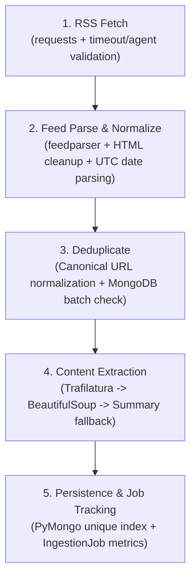

# News Pulse — RSS Ingestion Pipeline (Phase 1)

The **News Pulse Scraper** is a Python service responsible for continuously and idempotently ingesting news stories from diverse public RSS and Atom feeds, standardizing heterogeneous feed data into a unified schema, extracting full article text, deduplicating articles, and persisting them to MongoDB.

---

## What the Ingestion Pipeline Does

The pipeline operates in 5 stages:



1. **RSS Fetch**: Fetches raw feed XML over HTTP using `requests` with custom headers, timeouts, and byte limits.
2. **Normalize**: Normalizes disparate feed formats (RSS 2.0, Atom 1.0) into a single, clean `Article` model.
3. **Deduplicate**: Canonicalizes article URLs (stripping UTM params, tracking tokens, and fragments) and checks MongoDB to skip already-persisted stories before content extraction.
4. **Extract**: Downloads article web pages and extracts the body text via Trafilatura, falling back to BeautifulSoup heuristics, and finally falling back to the RSS summary if extraction fails.
5. **Persist**: Inserts unique articles into MongoDB (`articles` collection) protected by a unique index on `url`, and updates the run record in `ingestion_jobs`.

---

## News Sources Configured

Feed definitions are centralized in [`scraper/feeds.py`](file:///C:/Users/Lavis/OneDrive/Desktop/news-pulse/scraper/feeds.py):

| Source Name | Feed URL | Description | Enabled |
| :--- | :--- | :--- | :--- |
| **BBC News** | `https://feeds.bbci.co.uk/news/world/rss.xml` | BBC World News RSS feed | `True` |
| **NPR News** | `https://feeds.npr.org/1001/rss.xml` | NPR Top News Stories | `True` |
| **Al Jazeera** | `https://www.aljazeera.com/xml/rss/all.xml` | Al Jazeera English Top Stories | `True` |

---

## Normalized Article Schema

Every ingested article is stored in the `articles` collection in MongoDB with the following schema:

```json
{
  "_id": "ObjectId('...')",
  "title": "German Chancellor Merz calls state election a 'disaster' for his party",
  "summary": "Exit polls show damaging losses for Merz's centre-right CDU party...",
  "content": "Full extracted article text (up to thousands of characters)...",
  "source": "BBC News",
  "url": "https://www.bbc.co.uk/news/articles/cvwyz29n0nn2o",
  "publishedAt": "2026-09-21T03:22:44.000Z",
  "createdAt": "2026-09-21T08:56:33.065Z",
  "updatedAt": "2026-09-21T08:56:33.065Z",
  "clusterId": null
}
```

- **`title`**: Sanitized, unescaped plain text (HTML markup removed).
- **`source`**: Name of the publication.
- **`url`**: Canonical URL (unique identity).
- **`publishedAt`**: UTC `datetime` timestamp. If missing from the feed, defaults safely to current UTC time.
- **`summary`**: Clean description snippet with HTML tags stripped.
- **`content`**: Full extracted body text. If extraction fails, falls back cleanly to `summary`.
- **`clusterId`**: Preserved for Phase 2 topic clustering.

---

## Deduplication Strategy

1. **URL Canonicalization**:
   - Strips tracking query parameters (`utm_source`, `utm_medium`, `utm_campaign`, `utm_term`, `utm_content`, `fbclid`, `gclid`, `ocid`, `ref`).
   - Normalizes domain to lowercase (`BBC.CO.UK` -> `bbc.co.uk`).
   - Strips URL fragments (`#comments`).
   - Normalizes trailing slashes on sub-paths.
2. **Pre-Extraction Batch Filtering**:
   - Queries MongoDB with `{ "url": { "$in": candidate_urls } }` before downloading HTML pages.
   - Eliminates unnecessary network requests for articles already stored.
3. **Database Unique Index Guarantee**:
   - `db.articles.create_index([("url", 1)], unique=True)`
   - Any concurrent race condition catches `DuplicateKeyError` gracefully without aborting the pipeline.

---

## Content Extraction Fallback Chain

```text
[Article URL]
      ↓
Download HTML (Size-limited, 15s timeout, browser-like User-Agent)
      ↓ (Success)
1. Trafilatura Extraction  ────(Valid body >= 80 chars)───► Use Trafilatura Text
      ↓ (Failed/Empty)
2. BeautifulSoup Fallback  ────(Valid body >= 80 chars)───► Use BeautifulSoup Text
      ↓ (Failed/Empty)
3. RSS Summary Fallback    ───────────────────────────────► Use RSS Summary as Content
```

- **Extraction Failures**: Never crash ingestion. The failure is logged with URL and reason, and the RSS summary is preserved as content.

---

## Local Setup & Execution

### 1. Requirements

Ensure Python 3.10+ and MongoDB are available:
```bash
pip install -r requirements.txt
```

### 2. Environment Variables

Create `.env` in `scraper/` (or copy `.env.example`):
```bash
cp .env.example .env
```

```env
MONGODB_URI=mongodb://127.0.0.1:27017/news_pulse
LOG_LEVEL=INFO
REQUEST_TIMEOUT=15
SCRAPER_USER_AGENT=NewsPulseBot/1.0 (+https://github.com/example/news-pulse)
```

### 3. Run Pipeline Standalone

```bash
python main.py
```

### 4. Run Pipeline with Job Tracking

```bash
python main.py --job-id job-run-001
```

### 5. Run Unit Tests

```bash
pytest tests -v
```

---

## Sample Execution Log

```text
2026-09-21 14:26:30,000 [INFO] news-pulse.scraper: Starting News Pulse RSS Ingestion Pipeline
2026-09-21 14:26:30,015 [INFO] news-pulse.scraper.db: Connected to MongoDB successfully: news_pulse
2026-09-21 14:26:30,025 [INFO] news-pulse.scraper.db: MongoDB indexes verified / created successfully.
2026-09-21 14:26:30,026 [INFO] news-pulse.scraper: Loaded 3 enabled news feed sources for ingestion.
2026-09-21 14:26:30,027 [INFO] news-pulse.scraper: --- Processing Feed: BBC News (https://feeds.bbci.co.uk/news/world/rss.xml) ---
2026-09-21 14:26:30,551 [INFO] news-pulse.scraper.parser: Feed [BBC News] successfully parsed: 29 entries found.
2026-09-21 14:26:30,554 [INFO] news-pulse.scraper: Feed [BBC News]: Normalized 29 valid candidates out of 29 entries.
2026-09-21 14:26:30,558 [INFO] news-pulse.scraper: Feed [BBC News]: 29 new articles identified (0 duplicates skipped).
2026-09-21 14:26:31,210 [INFO] news-pulse.scraper: Inserted article: [BBC News] German Chancellor Merz calls state election a 'disaster'
...
2026-09-21 14:26:57,526 [INFO] news-pulse.scraper: ============================================================
2026-09-21 14:26:57,526 [INFO] news-pulse.scraper: RSS ingestion complete
2026-09-21 14:26:57,526 [INFO] news-pulse.scraper: Feeds: 3 attempted / 3 successful / 0 failed
2026-09-21 14:26:57,526 [INFO] news-pulse.scraper: Fetched: 64
2026-09-21 14:26:57,526 [INFO] news-pulse.scraper: Inserted: 64
2026-09-21 14:26:57,526 [INFO] news-pulse.scraper: Duplicates: 0
2026-09-21 14:26:57,526 [INFO] news-pulse.scraper: Extraction failures: 0
2026-09-21 14:26:57,526 [INFO] news-pulse.scraper: ============================================================
```

---

## Topic Grouping Approach

Topic clustering groups related articles discussing the same event or narrative thread into cohesive clusters.

### Feature Representation: TF-IDF
- **Document Input**: For each article, the document is constructed strictly from the **headline/title and summary** (`title` is double-weighted relative to `summary`). We intentionally exclude full article body text in this stage because extended article bodies contain tangentially related context, author bios, and sub-topics that introduce lexical noise.
- **Preprocessing**: Text is lowercased, HTML remnants and punctuation are removed, whitespace is normalized, and standard English stop words as well as broadcast filler words (e.g. `says`, `watch`, `video`, `reported`, `updates`) are removed.
- **Vectorization**: We use `scikit-learn`'s `TfidfVectorizer` with `ngram_range=(1, 2)` (capturing both unigrams like `election` and bigrams like `state election` or `ai safety`), `max_df=0.85`, and `min_df=1`.

---

## Similarity

- We compute the pairwise **Cosine Similarity** between TF-IDF document vectors:
  $$\text{cosine\_similarity}(\mathbf{u}, \mathbf{v}) = \frac{\mathbf{u} \cdot \mathbf{v}}{\|\mathbf{u}\| \|\mathbf{v}\|}$$
- Cosine similarity measures the orientation/angle between two term frequency vectors rather than absolute length, making it ideal for comparing news snippets that may vary slightly in length.

---

## Threshold Tuning & Observed Data

We determined the optimal similarity threshold empirically by inspecting the distribution of pairwise similarities across all 2,016 pairs in the ingested 64-article dataset:

| Percentile | Pairwise Cosine Similarity |
| :--- | :--- |
| **Max** | `0.3715` (Trump D.C. triumphal arch: BBC vs NPR) |
| **99th Percentile** | `0.0863` |
| **95th Percentile** | `0.0295` |
| **Median** | `0.0000` (over 80% of pairs share 0 common vocabulary) |

### Threshold Evaluation:
- **`threshold = 0.25`**: Produced only 6 multi-article clusters. Missed real multi-source coverage such as Austin ICE shooting (0.228) and Ethiopian rebel alliance (0.158).
- **`threshold = 0.20`**: Produced 8 multi-article clusters. Still missed Imran Khan sisters detained (0.145) and Russian parliamentary vote (0.112).
- **`threshold = 0.12` (Chosen Threshold)**:
  - Produced **13 cohesive multi-article clusters** (covering 27 articles) and **37 clean singleton clusters**.
  - **Zero false positives**: Every grouped pair corresponds to identical real-world breaking stories reported across publishers (e.g., Russian elections, Haiti president assassination suspects extradition, Aleppo weapons depot explosion, Austin Texas shooting, US-China AI safety talks, German Chancellor Merz election defeat).
  - High intra-cluster cohesion without collapsing into a mega-cluster.
- **`threshold <= 0.08`**: Began grouping tangentially related stories containing broad terms (e.g. linking UN general war debates with Sahel regional peacekeeping).

---

## Cluster Labels

Every cluster receives a concise, deterministic **2–4 word Title Cased label**:
1. **Multi-Article Clusters**: Term candidates are extracted from the mean TF-IDF vector of member articles. Candidates are boosted if they appear across multiple headlines in the cluster. Generic terms and numeric years are filtered out, and the top 2–3 distinct n-grams are combined (e.g., `"Results Russia Parliamentary"`, `"Imran Khan Sisters Detained"`, `"Austin Texas Man"`, `"China Safety Talks"`).
2. **Singleton Clusters**: Salient words from the article's own headline are formatted in Title Case (e.g., `"Presley Gerber Cindy"`, `"Mourinho Fumes Referees"`).
3. **Optional AI Enhancement**: If `AI_PROVIDER=ollama` is configured, an asynchronous hook can optionally refine the label into a journalistic headline. If Ollama is offline or disabled (`AI_PROVIDER=none`), the deterministic label is always used. Ollama **never** influences clustering decisions.

---

## Limitations & Design Trade-offs

1. **Lexical vs. Semantic Similarity**: TF-IDF relies on lexical term overlap. If two publishers cover the exact same event using completely disjoint vocabularies (e.g., *"Automaker CEO steps down"* vs *"Car manufacturer chief resigns"* without common nouns), lexical TF-IDF may treat them as separate clusters.
2. **Cross-Topic Polysemy**: Very broad terms (e.g. *"war"*, *"crisis"*, *"economy"*) can create weak similarities across unrelated regional events if a threshold is set too low (which is why our threshold is bounded at `0.12` with average linkage).
3. **Linkage Choice**: We chose **average linkage** over single linkage to avoid the "chaining problem" where story A links to B and B links to C, inadvertently merging unrelated topics into a giant cluster.
4. **No Real-World Entity Resolution**: In accordance with project requirements, this phase does not attempt cross-source named entity graph resolution or Wikidata linking.

---

## Cloud Deployment (FastAPI HTTP Service)

In cloud environments (such as Render), the scraper runs as a lightweight, stateless HTTP service defined in [`scraper/server.py`](file:///C:/Users/Lavis/OneDrive/Desktop/news-pulse/scraper/server.py) instead of being spawned as a local child process.

### Service Endpoints

1. **`POST /run`**:
   - **Headers**:
     - `Content-Type: application/json`
     - `X-Ingestion-Secret: <secret>` or `Authorization: Bearer <secret>`
   - **Body**: `{ "jobId": "<unique_job_id>" }`
   - **Behavior**: Validates shared secret using constant-time `hmac.compare_digest` (prevents timing attacks). Dispatches the ingestion and deterministic topic clustering pipeline in `BackgroundTasks` and returns immediately with `202 Accepted`.
   - **Response**:
     ```json
     {
       "jobId": "job_1789982194079_2ih7y3",
       "status": "accepted"
     }
     ```
   - **Error**: `401 Unauthorized` if secret is missing or invalid.

2. **`GET /health`**:
   - **Behavior**: Liveness and readiness probe that verifies the FastAPI service is responsive and pings the configured MongoDB instance.
   - **Response**: `200 OK` (or `503 Service Unavailable` if database is down):
     ```json
     {
       "status": "healthy",
       "service": "news-pulse-scraper",
       "database": "connected",
       "timestamp": "2026-09-21T09:43:04.281855+00:00"
     }
     ```

### Render Deployment Configuration

- **Environment**: Python 3 (Linux container).
- **Root Directory**: `scraper`
- **Build Command**: `pip install -r requirements.txt`
- **Start Command**: `uvicorn server:app --host 0.0.0.0 --port $PORT`
- **Required Environment Variables**:
  - `MONGODB_URI`: MongoDB Atlas connection string (`mongodb+srv://...`).
  - `INGESTION_SERVICE_SECRET`: Shared secret matched with the backend REST API.
  - `AI_PROVIDER`: `none` (Ollama is not required in production).
  - `LOG_LEVEL`: `INFO`


